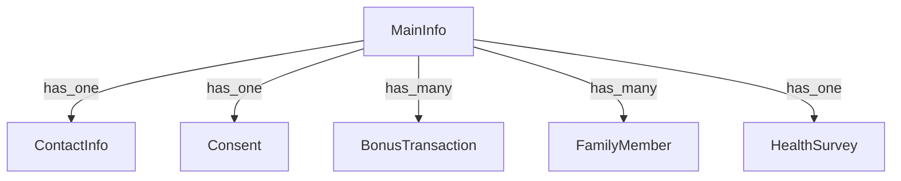

1. Существующих у тебя схем (MainInfo, ContactInfo и др.),
2. Методики работы с CRM через `CRMClient`,
3. Документации PaNa CRM (на основе `registration`, `patients`, `appointments`, `consents`, `family`, `bonus`, `questionnaire`).

---

## 🚧 ПЛАН ИНТЕГРАЦИИ С CRM (по слоям и шагам)

---

### 🔹 Шаг 0 — Подготовка (если не сделано)

**Цель**: обеспечить минимальную инфраструктуру для интеграции.

* [x] ✅ `CRMClient` с `get_token()` и `call()`.
* [x] ✅ Методы: `find_patient`, `create_patient`, `patch_patient`, `future_appointments`.
* [ ] ⬜ **Подключение новых endpoint'ов:** `/consents`, `/bonus`, `/family`, `/questionnaire`.

---

### 🔹 Шаг 1 — Уточнение и настройка основного пациента

#### Схемы:

* `patients_main_info` (MainInfo)
* `patients_contact_info` (ContactInfo)

#### Действия:

| CRM                               | Локально                | Описание                                    |
| --------------------------------- | ----------------------- | ------------------------------------------- |
| `POST /patients`                  | `create_patient()`      | Создание нового пациента                    |
| `GET /patients/search`            | `find_patient()`        | Поиск по телефону+дата рождения/пол         |
| `PATCH /patients/{id}`            | `patch_patient()`       | Обновление телефона/email/других данных     |
| `GET /patients/{id}/appointments` | `future_appointments()` | Список визитов пациента                     |
| ❗ `GET /patients/{id}`            | ⬜                       | Получить всю карточку — пока не реализовано |

#### План:

* [x] В `CRMClient`: реализовано.
* [x] В `CRMIntegrationMixin`: `sync_create_with_crm`, `patch_contacts_in_crm`, `calc_account_status`.
* [ ] В `MainInfo` и `ContactInfo`: использовать CRM при `create`, `update`, `delete`.

#### Приоритет:

**⏫ Высокий** — основа всей синхронизации.

---

### 🔹 Шаг 2 — Интеграция согласий (Consents)

#### Схемы:

* Новая коллекция `patients_consents`
* `ConsentEnum`, `ConsentSchema`

#### CRM:

* `GET /patients/{id}/consents`
* `PATCH /patients/{id}/consents`

#### План:

* [ ] В `CRMClient`:

  * `get_consents(patient_id) -> List[str]`
  * `set_consents(patient_id, consents: List[str])`
* [ ] Новая модель `ConsentCrud` (inline к `MainInfo`)
* [ ] UI: чекбоксы или цветовые карты для выбора.

#### Приоритет:

**⏫ Высокий** — требуется для юридической части регистрации и мед. действия.

---

### 🔹 Шаг 3 — Интеграция бонусов (Bonus program)

#### Схемы:

* `BonusProgramSchema`, `BonusTransactionSchema`
* inline `bonus_transactions: List[...]`

#### CRM:

* `GET /patients/{id}/bonus`
* `GET /patients/{id}/bonus/transactions`

#### План:

* [ ] В `CRMClient`:

  * `get_bonus_balance(patient_id) -> int`
  * `get_bonus_history(patient_id) -> List[dict]`
* [ ] Новая admin-модель `BonusCrud`, inline-модель `BonusTransactionInlineCrud`
* [ ] Только readonly поля (без PATCH)

#### Приоритет:

**⏫ Высокий** — влияет на лояльность, нужно для ЛК и мотивации.

---

### 🔹 Шаг 4 — Интеграция семьи (Family)

#### Схемы:

* `FamilyMemberSchema`
* inline `family: List[...]` в `MainInfo`

#### CRM:

* `GET /patients/{id}/family`
* `POST /patients/{id}/family`
* `PATCH /patients/{id}/family/{fid}`
* `DELETE /patients/{id}/family/{fid}`

#### План:

* [ ] В `CRMClient`:

  * `get_family(patient_id) -> List[dict]`
  * `create_family_member()`, `update_family_member()`, `delete_family_member()`
* [ ] Новая inline-модель `FamilyInlineCrud` с `dot_field_path='family'`
* [ ] Вывести в ЛК (управление родственниками: телефоны, связь, дата рождения, бонусы)

#### Приоритет:

**🔼 Средний**, но важен для будущих программ лояльности и совместных бонусов.

---

### 🔹 Шаг 5 — Интеграция анкеты здоровья (Questionnaire)

#### Схемы:

* `HealthSurveySchema`

#### CRM:

* `GET /patients/{id}/questionnaire`
* `PATCH /patients/{id}/questionnaire`

#### План:

* [ ] В `CRMClient`:

  * `get_questionnaire(patient_id)`
  * `update_questionnaire(patient_id, answers)`
* [ ] CRUD-модель `HealthSurveyCrud` (inline к `MainInfo`)
* [ ] Синхронизация после заполнения пациентом в ЛК

#### Приоритет:

**🔼 Средний**, но критично для предварительной подготовки перед визитом.

---

## 📦 Пример зависимости моделей

---

### ✅ Рекомендуемый порядок работ (дорожная карта)

| Этап | Что делать                                           | Модели                         | Статус          |
| ---- | ---------------------------------------------------- | ------------------------------ | --------------- |
| 1    | Подключить `/patients` CRM синхронно в `MainInfo`    | MainInfo, ContactInfo          | ✅ Почти готово  |
| 2    | Добавить модель Consent + `get/set` CRM              | ConsentSchema                  | ⬜ Важно         |
| 3    | Добавить Bonus (баланс + история)                    | BonusProgram, BonusTransaction | ⬜ Важно         |
| 4    | Подключить семью (CRUD на CRM)                       | FamilyMemberSchema             | ⬜ Полезно       |
| 5    | Задействовать анкету здоровья (опционально readonly) | HealthSurveySchema             | ⬜ Второстепенно |

---

### 💬 Если кратко:

Ты уже реализовал **основу** (пациенты, CRMClient, авто-CRUD, маршруты). Теперь нужно:

1. Расширить `CRMClient` нужными методами;
2. Создать по одной Pydantic-схеме + admin-классу на каждую сущность CRM;
3. Обеспечить их правильную привязку (inline/standalone);
4. Настроить UI — всё подтянется автоматически, если описать `Field(..., json_schema_extra=...)`.
